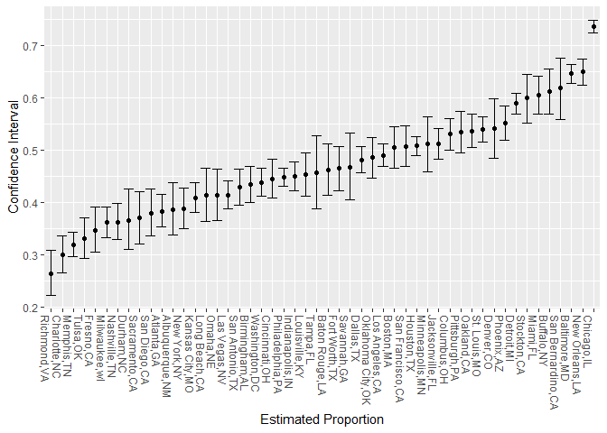
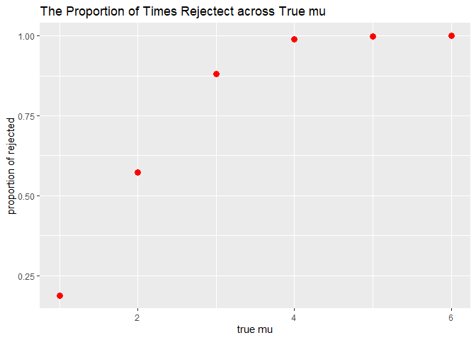
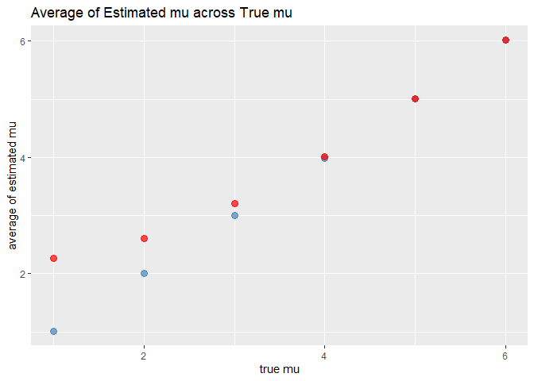

qz2493_datasci_hw5
================
Qingyue Zhuo qz2493
2022-11-13

### Problem 2

#### Import Data

``` r
homi = read_csv("C:/Users/HW/Desktop/courses/fall 2022/data science/hw/hw5/homicide-data.csv")
```

    ## Rows: 52179 Columns: 12
    ## ── Column specification ────────────────────────────────────────────────────────
    ## Delimiter: ","
    ## chr (9): uid, victim_last, victim_first, victim_race, victim_age, victim_sex...
    ## dbl (3): reported_date, lat, lon
    ## 
    ## ℹ Use `spec()` to retrieve the full column specification for this data.
    ## ℹ Specify the column types or set `show_col_types = FALSE` to quiet this message.

The raw data contains 52179 observations of 12 variables, the names of
the variable are uid, reported_date, victim_last, victim_first,
victim_race, victim_age, victim_sex, city, state, lat, lon, disposition.

#### Create “city_state” variable

``` r
homi = homi %>%
  janitor::clean_names() %>%
  mutate(city_state = str_c(city, state, sep = ","))
```

#### Summary within Cities

``` r
homi_table = 
  homi %>%
  mutate(result = case_when(
      disposition == "Closed without arrest" ~ "unsolved",
      disposition == "Open/No arrest"        ~ "unsolved",
      disposition == "Closed by arrest"      ~ "solved"
  )) %>% 
  group_by(city_state) %>% 
  summarize(n = n(),
            unsolved = sum(result == "unsolved")) %>%
  filter(city_state != "Tulsa,AL")

knitr::kable(homi_table)
```

| city_state        |    n | unsolved |
|:------------------|-----:|---------:|
| Albuquerque,NM    |  378 |      146 |
| Atlanta,GA        |  973 |      373 |
| Baltimore,MD      | 2827 |     1825 |
| Baton Rouge,LA    |  424 |      196 |
| Birmingham,AL     |  800 |      347 |
| Boston,MA         |  614 |      310 |
| Buffalo,NY        |  521 |      319 |
| Charlotte,NC      |  687 |      206 |
| Chicago,IL        | 5535 |     4073 |
| Cincinnati,OH     |  694 |      309 |
| Columbus,OH       | 1084 |      575 |
| Dallas,TX         | 1567 |      754 |
| Denver,CO         |  312 |      169 |
| Detroit,MI        | 2519 |     1482 |
| Durham,NC         |  276 |      101 |
| Fort Worth,TX     |  549 |      255 |
| Fresno,CA         |  487 |      169 |
| Houston,TX        | 2942 |     1493 |
| Indianapolis,IN   | 1322 |      594 |
| Jacksonville,FL   | 1168 |      597 |
| Kansas City,MO    | 1190 |      486 |
| Las Vegas,NV      | 1381 |      572 |
| Long Beach,CA     |  378 |      156 |
| Los Angeles,CA    | 2257 |     1106 |
| Louisville,KY     |  576 |      261 |
| Memphis,TN        | 1514 |      483 |
| Miami,FL          |  744 |      450 |
| Milwaukee,wI      | 1115 |      403 |
| Minneapolis,MN    |  366 |      187 |
| Nashville,TN      |  767 |      278 |
| New Orleans,LA    | 1434 |      930 |
| New York,NY       |  627 |      243 |
| Oakland,CA        |  947 |      508 |
| Oklahoma City,OK  |  672 |      326 |
| Omaha,NE          |  409 |      169 |
| Philadelphia,PA   | 3037 |     1360 |
| Phoenix,AZ        |  914 |      504 |
| Pittsburgh,PA     |  631 |      337 |
| Richmond,VA       |  429 |      113 |
| Sacramento,CA     |  376 |      139 |
| San Antonio,TX    |  833 |      357 |
| San Bernardino,CA |  275 |      170 |
| San Diego,CA      |  461 |      175 |
| San Francisco,CA  |  663 |      336 |
| Savannah,GA       |  246 |      115 |
| St. Louis,MO      | 1677 |      905 |
| Stockton,CA       |  444 |      266 |
| Tampa,FL          |  208 |       95 |
| Tulsa,OK          |  583 |      193 |
| Washington,DC     | 1345 |      589 |

#### Proportion Test of Baltimore

``` r
baltimore_df =
  homi_table %>%
  filter(city_state == "Baltimore,MD")

baltimore_test = 
  prop.test(
    x = baltimore_df %>% pull(unsolved), 
    n = baltimore_df %>% pull(n)) %>%
  broom::tidy()

baltimore_test %>% select(estimate, starts_with("conf"))
```

    ## # A tibble: 1 × 3
    ##   estimate conf.low conf.high
    ##      <dbl>    <dbl>     <dbl>
    ## 1    0.646    0.628     0.663

The estimated proportion is 0.6455607, the 95% confidence interval is
\[0.6275625, 0.6631599\].

#### Proportion Test across Cities

-   Define a function

``` r
city_test = function(x,n){
  prop.test(x,n) %>%
  broom::tidy(prop_test_result) %>%
    select(estimate, starts_with("conf"))}
```

-   Iterate over each city

``` r
result_df = 
  homi_table %>% 
  mutate(summary = map2(as.list(homi_table$unsolved), as.list(homi_table$n), city_test)) %>%
  select(city_state, summary) %>%
  unnest()
```

    ## Warning: `cols` is now required when using unnest().
    ## Please use `cols = c(summary)`

``` r
result_df
```

    ## # A tibble: 50 × 4
    ##    city_state     estimate conf.low conf.high
    ##    <chr>             <dbl>    <dbl>     <dbl>
    ##  1 Albuquerque,NM    0.386    0.337     0.438
    ##  2 Atlanta,GA        0.383    0.353     0.415
    ##  3 Baltimore,MD      0.646    0.628     0.663
    ##  4 Baton Rouge,LA    0.462    0.414     0.511
    ##  5 Birmingham,AL     0.434    0.399     0.469
    ##  6 Boston,MA         0.505    0.465     0.545
    ##  7 Buffalo,NY        0.612    0.569     0.654
    ##  8 Charlotte,NC      0.300    0.266     0.336
    ##  9 Chicago,IL        0.736    0.724     0.747
    ## 10 Cincinnati,OH     0.445    0.408     0.483
    ## # … with 40 more rows

-   plot

``` r
ggplot(result_df, aes(x = reorder(city_state, estimate), y = estimate)) +
  geom_point() +
  theme(axis.text.x = element_text(angle = -90, hjust = 0)) +
  geom_errorbar(aes(ymin = conf.low, ymax = conf.high)) +
  xlab("Estimated Proportion") +
  ylab("Confidence Interval")
```

<!-- -->

### Problem 3

#### Generate function that returns mu_hat and p.value

``` r
sim_mu_pval = function(samp_size = 30, mu, sigma = 5) {
  sim_data = tibble(
    x = rnorm(n = samp_size, mean = mu, sd = sigma),)
  sim_data %>% 
    t.test(conf.level = 0.95) %>%
    broom::tidy() %>%
    select(estimate, p.value)}
```

#### Simulation of “mu = 0”

``` r
sim_results_df = 
  expand_grid(
    mean_null = 0,
    iter = 1:5000) %>% 
  mutate(
    estimate_df = map(.x = mean_null, ~sim_mu_pval(mu = .x))
  ) %>% 
  unnest(estimate_df)

sim_results_df
```

    ## # A tibble: 5,000 × 4
    ##    mean_null  iter estimate p.value
    ##        <dbl> <int>    <dbl>   <dbl>
    ##  1         0     1  -0.437  0.656  
    ##  2         0     2  -0.815  0.411  
    ##  3         0     3   0.377  0.679  
    ##  4         0     4  -0.564  0.629  
    ##  5         0     5  -0.248  0.834  
    ##  6         0     6  -0.895  0.329  
    ##  7         0     7   0.245  0.798  
    ##  8         0     8  -2.87   0.00455
    ##  9         0     9  -0.0959 0.909  
    ## 10         0    10   0.158  0.860  
    ## # … with 4,990 more rows

#### Simulation of “mu = {1,2,3,4,5,6}”

``` r
mu_true = c(1,2,3,4,5,6)

sim_results_df2 = 
  expand_grid(
    mean_null = mu_true,
    iter = 1:5000
  ) %>% 
  mutate(
    estimate_df = map(.x = mean_null, ~sim_mu_pval(mu = .x))
  ) %>% 
  unnest(estimate_df)

sim_results_df2
```

    ## # A tibble: 30,000 × 4
    ##    mean_null  iter estimate p.value
    ##        <dbl> <int>    <dbl>   <dbl>
    ##  1         1     1    1.61  0.0562 
    ##  2         1     2    2.09  0.0284 
    ##  3         1     3    2.47  0.00800
    ##  4         1     4    0.438 0.552  
    ##  5         1     5    0.265 0.713  
    ##  6         1     6    2.06  0.00678
    ##  7         1     7    0.462 0.645  
    ##  8         1     8    0.861 0.311  
    ##  9         1     9    1.55  0.115  
    ## 10         1    10    0.261 0.762  
    ## # … with 29,990 more rows

#### Plot showing the proportion of times rejected & mean of estimate

-   Function that calculates the “rejection proportion”

``` r
prop = function(mean_input) {
  sim_data = 
    sim_results_df2 %>%
    filter(mean_null == mean_input)
  length(sim_data$p.value[sim_data$p.value < 0.05])/5000
}
```

-   Plot

``` r
plot1 = 
  unnest(tibble( mu_true, prop = map(mu_true, prop))) %>%
  ggplot(aes(x = mu_true , y = prop)) + 
  geom_point(size = 3, color = "red") +
  labs(
    x = "true mu",
    y = "proportion of rejected",
    title = "The Proportion of Times Rejectect across True mu"
  )
```

    ## Warning: `cols` is now required when using unnest().
    ## Please use `cols = c(prop)`

``` r
plot1
```

<!-- -->

-   Description:
    -   There is a positive relationship between effect size and power.
    -   The power is approximately equal to one when mu is 4, 5, or 6,
        suggesting the null was almost rejected 100% of times.

#### Plot showing the average estimate of mu_hat

-   Function that calculates the average estimates for the whole sample

``` r
esti = function(mean_input) {
  sim_data = 
    sim_results_df2 %>%
    filter(mean_null == mean_input)
  mean(sim_data$estimate)
}
```

-   Sample for which the null was rejected

``` r
samp_rej = 
  sim_results_df2 %>%
  filter(p.value < 0.05)
```

-   Function that calculates the average estimates for the sample
    rejected

``` r
esti2 = function(mean_input) {
  sim_data = 
    samp_rej %>%
    filter(mean_null == mean_input)
  mean(sim_data$estimate) }
```

-   Plot2

``` r
plot2 = 
  unnest(tibble(mean_input = mu_true, esti1 = map(mu_true, esti), esti2 = map(mu_true, esti2))) %>% 
  ggplot(aes(x = mean_input, y = esti1)) + 
  geom_point(color = "steelblue", size = 3, alpha = 0.7) +
  geom_point(aes(x = mean_input, y = esti2), color = "red", size = 3, alpha = 0.7) +
  labs(
    x = "true mu",
    y = "average of estimated mu",
    title = "Average of Estimated mu across True mu"
  )
```

    ## Warning: `cols` is now required when using unnest().
    ## Please use `cols = c(esti1, esti2)`

``` r
plot2
```

<!-- -->

-   Description:
    -   The average mu_hat for “rejected samples” is somehow greater
        than true mu, while the two almost equal when true mean is 4, 5
        or 6.
    -   When true mu is 4, 5, or 6: the power is approximately equal to
        1, which means almost all samples are rejected(correctly),
        suggesting average estimate of rejected samples is extremely
        close to the true mean;
    -   When true mu is 1, 2, or 3: the power is observably smaller
        than 1. The estimated values should be quite extreme so that the
        null is rejected, suggesting an significant derivation from true
        mean.
