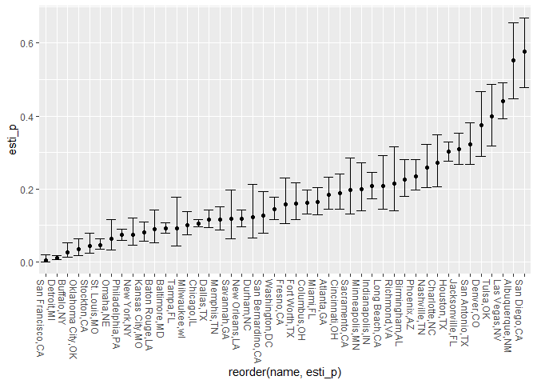

qz2493_datasci_hw5
================
Qingyue Zhuo qz2493
2022-11-13

### Problem 2

#### Import Data

``` r
urlfile = "https://raw.githubusercontent.com/washingtonpost/data-homicides/master/homicide-data.csv"
homi = read_csv(url(urlfile))
```

    ## Rows: 52179 Columns: 12
    ## ── Column specification ────────────────────────────────────────────────────────
    ## Delimiter: ","
    ## chr (9): uid, victim_last, victim_first, victim_race, victim_age, victim_sex...
    ## dbl (3): reported_date, lat, lon
    ## 
    ## ℹ Use `spec()` to retrieve the full column specification for this data.
    ## ℹ Specify the column types or set `show_col_types = FALSE` to quiet this message.

The raw data contains 52179 observations of 12 variables, the names of
the variable are uid, reported_date, victim_last, victim_first,
victim_race, victim_age, victim_sex, city, state, lat, lon, disposition.

#### Create a New Variable

``` r
homi = homi %>%
  mutate(city_state = paste(city,state,sep = ","))
```

#### Summary within Cities

``` r
homi_table = 
  homi %>%
  group_by(city_state, disposition) %>% 
  summarize(n = n()) %>%
  pivot_wider(names_from = disposition, values_from = n) %>%
  select(-"Closed by arrest") %>%
  rename(
    "Total Number of Homicides" = "Open/No arrest",
    "Number of Unsolved Homicides" = "Closed without arrest"
    ) %>%
  drop_na()
```

    ## `summarise()` has grouped output by 'city_state'. You can override using the
    ## `.groups` argument.

``` r
knitr::kable(homi_table) #How to deal with NAs
```

| city_state        | Number of Unsolved Homicides | Total Number of Homicides |
|:------------------|-----------------------------:|--------------------------:|
| Albuquerque,NM    |                           52 |                        94 |
| Atlanta,GA        |                           58 |                       315 |
| Baltimore,MD      |                          152 |                      1673 |
| Baton Rouge,LA    |                           16 |                       180 |
| Birmingham,AL     |                           64 |                       283 |
| Buffalo,NY        |                            8 |                       311 |
| Charlotte,NC      |                           44 |                       162 |
| Chicago,IL        |                          387 |                      3686 |
| Cincinnati,OH     |                           49 |                       260 |
| Columbus,OH       |                           80 |                       495 |
| Dallas,TX         |                           78 |                       676 |
| Denver,CO         |                           46 |                       123 |
| Detroit,MI        |                           16 |                      1466 |
| Durham,NC         |                           11 |                        90 |
| Fort Worth,TX     |                           35 |                       220 |
| Fresno,CA         |                           23 |                       146 |
| Houston,TX        |                          346 |                      1147 |
| Indianapolis,IN   |                          102 |                       492 |
| Jacksonville,FL   |                          141 |                       456 |
| Kansas City,MO    |                           36 |                       450 |
| Las Vegas,NV      |                          175 |                       397 |
| Long Beach,CA     |                           27 |                       129 |
| Memphis,TN        |                           50 |                       433 |
| Miami,FL          |                           63 |                       387 |
| Milwaukee,wI      |                           37 |                       366 |
| Minneapolis,MN    |                           31 |                       156 |
| Nashville,TN      |                           57 |                       221 |
| New Orleans,LA    |                           98 |                       832 |
| New York,NY       |                           17 |                       226 |
| Oklahoma City,OK  |                           11 |                       315 |
| Omaha,NE          |                           10 |                       159 |
| Philadelphia,PA   |                           92 |                      1268 |
| Phoenix,AZ        |                           96 |                       408 |
| Richmond,VA       |                           20 |                        93 |
| Sacramento,CA     |                           23 |                       116 |
| San Antonio,TX    |                           87 |                       270 |
| San Bernardino,CA |                           19 |                       151 |
| San Diego,CA      |                           64 |                       111 |
| San Francisco,CA  |                            1 |                       335 |
| Savannah,GA       |                           12 |                       103 |
| St. Louis,MO      |                           40 |                       865 |
| Stockton,CA       |                           11 |                       255 |
| Tampa,FL          |                            8 |                        87 |
| Tulsa,OK          |                           55 |                       138 |
| Washington,DC     |                           74 |                       515 |

#### Estimation of the Proportion of Homicides Unsolved

``` r
prop_baltimore = prop.test(x = 152, n = 1673)

esti_and_CI_baltimore = 
  broom::tidy(prop_baltimore) %>%
  select(1,5,6) %>%
  mutate(
    CI = paste(round(conf.low,3), round(conf.high, 3), sep = ","),
    CI = paste("[", CI, "]"),
    estimate = round(estimate, 3)) %>%
  select(estimate, CI) 

esti_and_CI_baltimore 
```

    ## # A tibble: 1 × 2
    ##   estimate CI             
    ##      <dbl> <chr>          
    ## 1    0.091 [ 0.078,0.106 ]

The estimated proportion is 0.091, the 95% confidence interval is \[\[
0.078,0.106 \]\].

#### Iterate over Cities

-   define a function to generate estimated proportion and CI for each
    city

``` r
esti_and_CI = function(x,n){
  prop_test_result = prop.test(x,n)
  broom::tidy(prop_test_result) %>%
    select(1,5,6) %>%
    mutate(
    CI = paste(round(conf.low,3), round(conf.high, 3), sep = ","),
    CI = paste("[", CI, "]"),
    estimate = round(estimate, 3)) %>%
  select(estimate, CI)
}
```

-   build a tibble to store the result

``` r
homi_df = 
  tibble(
    name = homi_table$city_state,
    samp1 = as.list(homi_table$`Number of Unsolved Homicides`),
    samp2 = as.list(homi_table$`Total Number of Homicides`),
    esti_p = map2(.x = samp1, .y = samp2, ~esti_and_CI(x = .x, n = .y)[[1]]),
    conf_int = map2(.x = samp1, .y = samp2, ~esti_and_CI(x = .x, n = .y)[[2]])
    ) %>%
  select(name, esti_p, conf_int)
homi_df
```

    ## # A tibble: 45 × 3
    ##    name           esti_p    conf_int 
    ##    <chr>          <list>    <list>   
    ##  1 Albuquerque,NM <dbl [1]> <chr [1]>
    ##  2 Atlanta,GA     <dbl [1]> <chr [1]>
    ##  3 Baltimore,MD   <dbl [1]> <chr [1]>
    ##  4 Baton Rouge,LA <dbl [1]> <chr [1]>
    ##  5 Birmingham,AL  <dbl [1]> <chr [1]>
    ##  6 Buffalo,NY     <dbl [1]> <chr [1]>
    ##  7 Charlotte,NC   <dbl [1]> <chr [1]>
    ##  8 Chicago,IL     <dbl [1]> <chr [1]>
    ##  9 Cincinnati,OH  <dbl [1]> <chr [1]>
    ## 10 Columbus,OH    <dbl [1]> <chr [1]>
    ## # … with 35 more rows

``` r
unnest(homi_df)
```

    ## Warning: `cols` is now required when using unnest().
    ## Please use `cols = c(esti_p, conf_int)`

    ## # A tibble: 45 × 3
    ##    name           esti_p conf_int       
    ##    <chr>           <dbl> <chr>          
    ##  1 Albuquerque,NM  0.553 [ 0.447,0.655 ]
    ##  2 Atlanta,GA      0.184 [ 0.144,0.232 ]
    ##  3 Baltimore,MD    0.091 [ 0.078,0.106 ]
    ##  4 Baton Rouge,LA  0.089 [ 0.053,0.143 ]
    ##  5 Birmingham,AL   0.226 [ 0.18,0.28 ]  
    ##  6 Buffalo,NY      0.026 [ 0.012,0.052 ]
    ##  7 Charlotte,NC    0.272 [ 0.206,0.348 ]
    ##  8 Chicago,IL      0.105 [ 0.095,0.115 ]
    ##  9 Cincinnati,OH   0.188 [ 0.144,0.242 ]
    ## 10 Columbus,OH     0.162 [ 0.131,0.198 ]
    ## # … with 35 more rows

-   plot

``` r
#define a new function to separate the upper and lower limit of CIs
esti_and_CI_plot = function(x,n){
  prop_test_result = prop.test(x,n)
  broom::tidy(prop_test_result) %>%
    select(1,5,6) %>%
    mutate(
    conf.low = round(conf.low,3),
    conf.high = round(conf.high,3),
    estimate = round(estimate, 3)) %>%
  select(estimate, conf.low, conf.high)}

#store the estimated_portion, upper and lower limit in a new tibble
homi_df_plot = 
  tibble(
    name = homi_table$city_state,
    samp1 = as.list(homi_table$`Number of Unsolved Homicides`),
    samp2 = as.list(homi_table$`Total Number of Homicides`),
    esti_p = map2(.x = samp1, .y = samp2, ~esti_and_CI_plot(x = .x, n = .y)[[1]]),
    conf_low = map2(.x = samp1, .y = samp2, ~esti_and_CI_plot(x = .x, n = .y)[[2]]),
    conf_high = map2(.x = samp1, .y = samp2, ~esti_and_CI_plot(x = .x, n = .y)[[3]])
    ) %>%
  select(name, esti_p, conf_low, conf_high)
```

``` r
ggplot(unnest(homi_df_plot), aes(x = reorder(name,esti_p), y = esti_p)) +
  geom_point() +
  theme(axis.text.x = element_text(angle = -90, hjust = 0)) +
  geom_errorbar(aes(ymin = conf_low, ymax = conf_high))
```

    ## Warning: `cols` is now required when using unnest().
    ## Please use `cols = c(esti_p, conf_low, conf_high)`

<!-- -->
